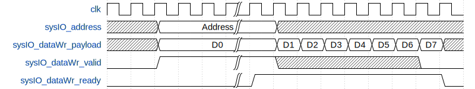
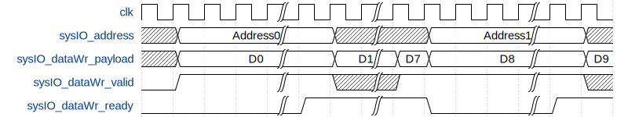
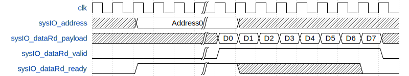
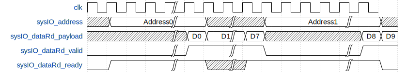

# General-Slow-DDR3-Interface

A general slow DDR3 interface.   
Very little resource consumption.  
Suits for all FPGAs with 1.5V IO voltage.  

## Specifications
* ___Designed to run at DDR-100. (The system freqency is 100MHz and DDR clock frequency is 50MHz)___  
*DDR-50? That's OK.*  
*DDR-10? OK, but refresh takes too much clocks.*  
*DDR-200? Depends on the hardware and the FPGA.*  
*DDR-400? It may not work. Whatever, take a shot.*  
__When changing the clock frequency, please modify the clkFreq in the slowDDR3Cfg and recompile it.__
* __Designed to work with LVCMOS IO__  
*Only has LVCMOSs? It can work.*  
* __Very low resource consumption__  
*Wish to attach a DDR3 module to a CPLD? Try it.*
* __Write in SpinalHDL__  
*Future is coming.*

## Files
* __slowDDR3.scala__  
The SpinalHDL design file.  
Compile it to get the output verilog file.
* __slowDDR3.v__  
Pre-compiled verilog file.  
Designed to run at 100MHz with a 128Mx16b DDR3 chip.
* __tb.v__  
Testbench file.  
A DDR3 model is required to do the simulation.  
You may find it at Micron's website.  
<u>[DDR3 Model](https://www.micron.com/search-results/simulation-models?searchRequest=verilog)</u>

## Timing
__The burst feature is not implemented yet, so multi read/write will not be faster than single.__  
The burst may increase the r/w speed to 3x or 4x.  
* __Single Write__  

* __Multi Write__  

* __Single Read__  

* __Multi Read__  
  

If Write and Read are issued at the same time, only write will be executed.  
You don't need to care about the refresh.

## Simulation
To simulate the design, you need to do some modifications to the model file.

1. change the type of the ddr3.v to ddr3.sv (system verilog)  

2. define the size in ddr3.sv  
   I use the den2048Mb  
   ```
   `define den2048Mb
   ```

3. define MAX_MEM in ddr3.sv  
   ```
   `define MAX_MEM  
   ```

3. comment this line in ddr3.sv  
   ```
   // if (dll_en) init_step = init_step + 1;  
   ```

4. add a line under it  
   ```
   init_step = init_step + 1;  
   ```

5. comment these 2 lines in ddr3.sv  
   ```
   // if (tck_avg - TCK_MAX >= 1.0)   
   // $display ("%m: at time %t ERROR: tCK(avg) maximum violation by %f ps.", $time, tck_avg - TCK_MAX);  
   ```

6. you are good to go.  


## Resource Comsunption and Speed

| FPGA | REGs | LUTs/ALMs | Stable Speed | Max Speed | Write Speed at Stable Speed | Read Speed at Stable Speed |
| :---: | :---: | :---: | :---: | :---: | :---: | :---: |
| Xilinx Kintex 7 |  148  |  164  |  DDR-100 |  \ |  300Mbits/s |  500Mbits/s |
| Intel Cyclone V |  175  |  115  |  DDR-100 |  \ |  300Mbits/s |  500Mbits/s | 
| Gowin GW2A-C | 147  |  216  |  DDR-80 |  DDR-90 |  240Mbits/s |  400Mbits/s |
